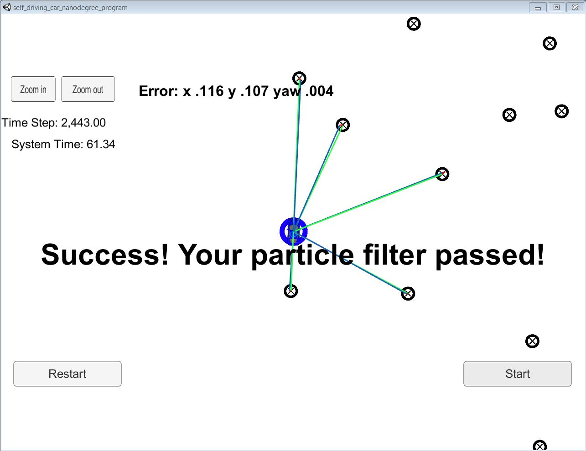

# Localization Using Particle Filter
Self-Driving Car Engineer Nanodegree Program

## Project Introduction
In this project the robot has been kidnapped and transported to a new location! Luckily it has a map of this location, a (noisy) GPS estimate of its initial location, and lots of (noisy) sensor and control data.
In this project I have implemented a 2 dimensional particle filter in C++. My particle filter uses this map and initial localization information (analogous to what a GPS would provide). At each time step the filter gets the observation and control data. The filter uses them to predict the position of the car.

#### Submission
This repository contains all the code needed to complete the final project for the Localization course in Udacity's Self-Driving Car Nanodegree.
I have submited my completed version of `particle_filter.cpp`, which is located in the `src` directory. 

## Running the Code
This project involves the Term 2 Simulator which can be downloaded [here](https://github.com/udacity/self-driving-car-sim/releases)

My setup is done using windows with docker installed. The remaining setup was done as a linux system.

The main protcol is that main.cpp uses for uWebSocketIO in communicating with the simulator.

INPUT: values provided by the simulator to the c++ program

// sense noisy position data from the simulator

["sense_x"] 

["sense_y"] 

["sense_theta"] 

// get the previous velocity and yaw rate to predict the particle's transitioned state

["previous_velocity"]

["previous_yawrate"]

// receive noisy observation data from the simulator, in a respective list of x/y values

["sense_observations_x"] 

["sense_observations_y"] 


OUTPUT: values provided by the c++ program to the simulator

// best particle values used for calculating the error evaluation

["best_particle_x"]

["best_particle_y"]

["best_particle_theta"] 

//Optional message data used for debugging particle's sensing and associations

// for respective (x,y) sensed positions ID label 

["best_particle_associations"]

// for respective (x,y) sensed positions

["best_particle_sense_x"] <= list of sensed x positions

["best_particle_sense_y"] <= list of sensed y positions


My job was to build out the methods in `particle_filter.cpp` until the simulator output says:

```
Success! Your particle filter passed!
```

# Implementing the Particle Filter
The directory structure of this repository is as follows:

```
root
|   build.sh
|   clean.sh
|   CMakeLists.txt
|   README.md
|   run.sh
|
|___data
|   |   
|   |   map_data.txt
|   
|   
|___src
    |   helper_functions.h
    |   main.cpp
    |   map.h
    |   particle_filter.cpp
    |   particle_filter.h
```

Following changes were done in the `particle_filter.cpp`

1. Inside the `init` function 
	1. I initialized num_particles 
	2. Used the initial x, y, theta measurements and standard deviation to generate particles using gaussian sampling.
2. Inside the `predictio`n function
	1. Depending on the value of control yaw_rate decided what method to update position and theta is to be used.
	2. Implemented the method to update position and theta for all particles using delta_t, velocity and yaw_rate
	3. Added gaussian noise to the updated particles using the standard deviation.
3. Inside the `updateWeights` function
	1. Using the current position and theta of each particle, for each particle obtained the coordinates of observations in world.
	2. Using the current position and theta of each particle, for each particle obtained the possible landmarks in range.
	3. Using `dataAssociation` function associated closest landmark to each observation.
	4. Depending on the position of observation and landmark positions in world refernce frame, obtained weight using Multivariate normal distribution
	5. Obtained weight for a given particle by multiplying all the weights for each landmark.
	6. Summed weights for every particle and used it normalize the final set of weights.
	7. Landmark and observation associates were set using the `SetAssociations` function.
4. Inside the `dataAssociation` function
	1. For every observation, checked each landmark and associated the landmark that was closest.
5. Inside the `resample` function
	1. Used the discrete_distribution function of random class to select particle. 
	2. For discrete_distribution, the probability was used as the weights updated in the updateWeights function.

One change was done in the `particle_filter.h`
1. Variable `std::default_random_engine gen` was added to the class `ParticleFilter`. This allowed usage of single generator for all gaussian value generator function.
	
The code is well commented and in no manner when previous information is stored, neither loops are implemented. The implementation is done by the books and kept straight forward.

## Performance and Accuracy

1. **Accuracy**: The implemented particle filter was able to localize vehicle position and yaw to within the values specified in the parameters `max_translation_error` and `max_yaw_error` in `src/main.cpp`.

2. **Performance**: The particle filter was able to complete execution in about 62 seconds.

The result at the end of simulation is captured in the following screenshot. 

